A bit of theory
===============

In order to help the user understand better the utilisation and functionalities
of this package, we make a short introduction to calibration and uncertainty
analysis.

Models and simulations
----------------------
Definitions
^^^^^^^^^^^
Models can be considered as approximations of reality based on mathematical
relations and inferences based on data.
A model receives forcing data (input data) and transforms it into output data
(simulation) by applying a series of mathematical procedures. The output of a
model can be of several types, defined in the following table:

.. csv-table:: Definitions of types of model output [#]_
    :header: **Term**, **Definition**
    :widths: 20, 80

    Simulation, "Quantitative reproduction of the behaviour of a system,
    given some defined inputs but without reference to any observed outputs."
    Forecast, "Quantitative reproduction of the behaviour of a system
    ahead of time, but given observations of the inputs, state variables,
    and outputs up to the forecast origin."
    Hindcast, "Application of forecasting to past data as if the inputs
    and outputs were only available up to a certain point in time."
    Projection, "Simulation of the future behaviour of a system given prior
    assumptions about future input data."

.. [#] Based on Beven & Young (2013).

As approximations of reality, models are often used to inform management decisions
and to understand better the behaviour of the systems they try to reproduce.
By comparing the simulation results to observations it is possible to detect
circumstances when the model does not perform well. By analysing these cases,
and collecting complementary data, the models may also be used to improve our
knowledge of the modelled system.

.. note::

    Models are useful tools to analyse the behaviour of a system and to
    increase our understanding of it.

The modelling process
^^^^^^^^^^^^^^^^^^^^^
The modelling process can be divided in 10 stages (Jakeman et al., 2006):

#. Definition of the model purpose
#. Specification of the modelling context: scope and resources
#. Conceptualisation of the system, specification of data and prior knowledge
#. Selection of model features
#. Determination of the method to identify model structure and parameter values
#. Selection of the performance criteria and algorithm
#. Identification of the model structure and parameter values
#. Conditional verification, including diagnostic testing
#. Quantification of uncertainty
#. Model evaluation

Of these stages, we are interested here in the last ones. However, some
of the techniques presented in this document may inform other stages of
the process too. Also, the calibrated model may be useful to inform initial
stages of the modelling process (e.g., which additional measurements to take)
in successive iterations.

At the end of the process, we hope to obtain a model that has the following
characteristics (Beck 1987):

* The parameters of the model should not vary with time. Parameter values
  that vary with time may be indicative of an inadequate model structure
  or of processes not taken into account.
* The variance of residuals and the covariance of parameters are low,
  indicating that the model parameters have been well identified.
* The residuals are small and are not attributable to any nonrandom causal
  mechanism.

Evaluation of model performance
^^^^^^^^^^^^^^^^^^^^^^^^^^^^^^^
If models are to be used as management tools, to provide evidence on which
to base decisions, it is only natural to assess their ability to simulate the
behaviour of the system. The comparison of simulations to observations or
expectations is known as model evaluation and can take several forms.

.. csv-table:: Definitions on model evaluation [#]_
    :header: **Term**, **Definition**
    :widths: 20, 80

    Verification, "Only for checks that a model computer code properly
    reproduces the equations it purports to solve. Will generally be only
    conditional verification dependent on the range of tests carried out."
    Validation, "Conditional evaluation that a model computer code reproduces
    some observed behaviour of the system being studied to an acceptable
    degree."
    Falsification, "An assessment that a model computer code does not
    reproduce some observed behaviour of the system to an acceptable degree."
    Fit-for-purpose, "Conditional evaluation that a computer model code
    is suitable for use in a particular type of application."

.. [#] Modified from Beven & Young (2013, Table 3).

Bennett et al. (2013) propose a five-step procedure to assess the performance
of environmental models:

#. Reassessment of the model's aim, scale and scope. Make sure you have
   a clear idea of the model's objective: which are the main variables of interest
   and for what they will be used. This includes stating the desired quality
   of the simulations, i.e., what constitutes good performance in your
   particular modelling setup.
#. Characterisation of the data for calibrating and testing. Check the quality
   of the data (presence of outliers, inhomogeneities, etc.) and its extension
   (is it sufficient?). Select data subsets for calibration and validation.
#. Visual and other analysis to detect bad model behaviour and to characterise
   overall performance. Use plots, graphs, animations and other visual methods
   to gain an overview of overall performance.
#. Selection of basic performance criteria. Select metrics, such as RMSE and
   :math:`r^2`, to measure model performance. Bennett et al. (2013) provide
   several methods for measuring quantitative
   model performance. The selected method needs to take into account
   the modelling objective and available data. For a comprehensive evaluation
   of models it is advisable to use systems of metrics
   (or multiple-objective functions) that measure different aspects of
   model performance.
#. Use of more advanced methods to solve modelling problems. Analyse the
   evaluation of model performance and assess whether any refinement is
   necessary in the process, going back to previous stages if necessary.

If the model does not perform well, this may indicate:

* the available data is insufficient to calibrate the model properly, and more
  data should be obtained;
* there are problems with the input data (there might be unaccounted biases
  or other issues);
* it could be advisable to use another calibration method (a local maximum
  might have been attained, instead of the global maximum);
* the model structure needs to be improved.

A note of caution
^^^^^^^^^^^^^^^^^
While models are invaluable tools for scientific research and management,
they are not perfect and it is necessary for the modeller to be aware of their
limitations. The absolute validation and verification of numerical
models is impossible for epistemic reasons (Oreskes et al. 1994).
A model cannot reproduce exactly the behaviour of a natural system because
of our limited knowledge of the system. In fact, a model is an incomplete
representation of reality that uses approximations and assumptions.
In addition, measurements capture the state of the system in a limited way:
they are subject to measurement error and there may be limitations in spatial
or temporal resolution.

Thus, validation and verification are only conditional (Boschetti et al. 2011).
They are conditional to the ranges of parameter values and
input data used: model or data deficiencies not yet detected might be
discovered in the future, when the model has been tested in other situations
or with more data.

The model output also depends on the implicit and explicit assumptions made in
its specification and how the behaviour of the system has been implemented.
In fact, the model will not be able to reproduce a behaviour that has not
been specified in its code. Also, the calibration data informs the values
of the parameters. This means that the model will perform best when the
behaviour of the system is similar to the behaviour reflected in the
calibration data.

.. note::

    A simulation is only as good as data and model specification allow it to be.

In order to guard against model and data imperfections it is best practice to
estimate and communicate uncertainty.

Identifiability
---------------
An important concept in the modelling process is that of identifiability.
Parameter identifiability analysis assesses whether it is possible to determine
a unique vector of parameter values that optimises model performance or there
are multiple parameter values that result in a similar model performance.
The result of a lack of identifiability is the absence of a unique optimum
combination of parameter values (the model performs with similar good
performance for different combinations of parameter values) and in high
error variances and covariances of parameters. Good
introductions to the concept of identifiability are given by Beck (1987) and
Guillaume et al. (2019).

.. epigraph::

    "Parameter identifiability analysis assesses whether it is theoretically
    possible to estimate unique parameter values from data, given the quantities
    measured, conditions present in the forcing data, model structure (and
    objective function), and properties of errors in the model and observations.
    In other words, it tackles the problem of whether the right *type* of data
    is available to estimate the desired parameter values."
    Guillaume et al. (2019, p. 418)

Thus, the analysis of identifiability is related to the design of experiments
and monitoring programs, so that the collected data ensures optimal
identifiability. If the model structure is suitable to the modelled system,
obtaining more data should result in a reduced parameter uncertainty. However,
this only happens if the measure is of the right type. This is also related to
the concept of data worth.

In a linear system of equations, parameter values are identifiable when
the number of unknowns is less than the number of observations. When
the number of unknowns is greater than the number of observations, the
system is underdetermined and the problem is ill-posed (and infinite solutions
are possible).

In a complex nonlinear environmental models, instead, the previous rule is not
applicable and more sophisticated methods are necessary. In this type
of models we often find a lack of identifiability, since the complexity of
the model is usually greater than the available information about the
behaviour of the system. But having as much (or more) observations as
parameters does not ensure they are identifiable. For example, a model may
include descriptions of
behaviours not present in the calibration data set, and thus their parameter
values cannot be informed by observations. In other cases, it may not be possible
to distinguish between several overlapping processes from the available data. Also,
the model may even simulate state variables for which there are no available
observations.

Sources of unidentifiability
^^^^^^^^^^^^^^^^^^^^^^^^^^^^
We can find several types of unidentifiability:

* Structural or a priori unidentifiability. It is due to the model structure
  (conceptualisation of the system, equations, objective function, model of the
  error structure). This type of unidentifiability can be analysed irrespective
  of the availability of data.
  When there is structural unidentifiability, there is "a lack of information about one
  or more model parameters and results in unbounded variation of the parameters
  even in the absence of noise."
  Solving structural unidentifiability may involve acquiring data about other
  model variables or using a different model structure.
* Practical or a posteriori unidentifiability: it corresponds to unidentifiability
  due to other sources than model structure, mainly forcing dataset and model
  and observation errors.

    - Unidentifiability due to the forcing dataset. Complex models can include
      formulations describing different types of behaviours. If one of those
      behaviours is not represented in the calibration data, there is no
      information to estimate the value of the parameters specifically related
      to that behaviour. Solving this issue would require collecting data for
      different experimental or environmental conditions.
    - Unidentifiability due to model and observation errors. The presence of
      structural errors and measurement noise/error results in parameter
      uncertainty that may affect parameter identifiability. To improve
      the situation it may help analysing the influence of measurement error
      on parameter estimation.

.. note::

    Structural unidentifiability implies practical unidentifiability.
    But structural identifiability does not imply practical identifiability.

Methods to analyse identifiability
^^^^^^^^^^^^^^^^^^^^^^^^^^^^^^^^^^
Structural identifiability can be assessed by analysing the model's equations.
For example, in the following equations the parameter values are unidentifiable:

.. math::

    Y = (\alpha + \beta)X

    Y = \alpha\beta X

Infinite combinations of values for :math:`\alpha` and :math:`\beta` give the
same result.

Identifiability can also be assessed using sensitivity analysis tools.
If a the response of a model is insensitive to a parameter, the parameter
is unidentifiable. However, a model may be sensitive to a given parameter
and it may still not be possible to identify the parameter value.

Identifiability can also be analysed by visualizing the model's response surface
with real or synthetic data. The existence
of flat surfaces indicates unidentifiability, while different peaks with equal
objective function values are indicative of local identifiability. For simple models,
it is possible to visualize the response surface using 2D or 3D plots. For more
complex models, it is possible to use dotty plots, which show the variation of
the response variable for one or two parameters while varying all other parameters.

Finally, some indices have also been proposed to evaluate identifiability.
It is the case of identifiability measure proposed by Doherty & Hunt (2009)
based on the error variance analysis.

Calibration
-----------
Calibration, parameter estimation and history matching are three synonyms for
the process of finding the optimal value of a model's parameters. Optimality
is here defined as the minimisation of an objective
function, representing some kind of distance between simulated and observed
values. Usually the modeller aims to obtain a global optimum, and then assesses
parameter and predictive uncertainty with respect to this optimum. The objective
is that parameter and predictive uncertainty should be reduced after the calibration
process.

.. epigraph::

    **Global optimum:** best solution across the entire parameter space.

    **Local optimum:** best solution in its immediate neighbourhood in the
    parameter space.

When the conditions are optimal, i.e., there is a clear global optimum and
there are no local optima, an automatic search algorithm may be used.

However, the identification of an optimum may be hampered by the use of threshold
parameters, by correlation between parameters, by autocorrelation and
heteroscedasticity in the residuals and by insensitive parameters. These
effects may cause local minima, valleys and plateaus in the parameter
response surface. In such cases, global calibration
methods (such as Differential Evolution) may be more appropriate. But there
cases when even these methods may have problems in identifying a simple set
of parameter values. Instead of an optimum there are several optima with
similar performance. This is known as equifinality (Beven & Freer, 2001).

Some more sophisticated techniques try to address the equifinality problem.
For example, Monte Carlo methods such as GLUE (Generalized Likelihood
Uncertainty Estimation) (Beven & Binley, 1992). The GLUE method is not
implemented in this package, but it can be applied easily by properly
treating the output of the :func:`monte_carlo` function.

Also, the Iterative Ensemble Smoother, rather than finding an optimum set of
parameter values, obtains several optimum sets of parameter values.
The method draws several random samples of the prior
parameter distributions and adjusts their values iteratively, so that each
set of parameter values can be considered to be calibrated. The ensemble
of optimized sets can be considered as a sampling of the posterior
distribution.

Validation
----------
Validation or, more appropriately, conditional validation consists in the
evaluation of model performance to conditions that differ from calibration
ones. The objective is to test whether the model performs equally well
under a different set of circumstances.

If the simulated behaviour of the system is consistent with the observed
behaviour, we cannot assume the model has been absolutely validated; it
has only been validated for the sets of circumstances included in the
calibration and validation data sets.

If the model results are incoherent with the observations, it would be
necessary to review the data, model structure and parameter values to
identify the source of the mismatch. In a sense, rather than confirming
the model validity, the objective of validation may be seen as an attempt
to falsify the model, to find areas where it needs improvement.

Sensitivity analysis
--------------------
Should we vary slightly our modelling assumptions and the input data,
the predicted behaviour would also vary. How much would the simulated behaviour
vary if we varied model structure, parameter values and input data within
reasonable ranges? Answering this question is the aim of the sensitivity
analysis.

In other words, sensitivity analysis is the analysis of how the model's output
varies with variations in the parameter values. This definition can be translated
into practice in different ways:

* Defining sensitivity as the partial derivative of the output :math:`Y` with
  respect to a parameter :math:`X_i`: :math:`S_i={\delta Y}/{\delta X_i}`.
  This is the usage in local sensitivity analyses (sensitivity is evaluated
  at a given point), and sensitivity indices are often estimated by varying
  one parameter at a time. However, in nonlinear models sensitivity varies
  within the parameter space.
* Linear regression coefficients can be considered as sensitivity indices in
  linear models. In particular, standardized regression coefficients (SRC)
  indicate the contribution of the variance of each input factor to the model
  output variance. The data for the linear regression can be obtained from
  Monte Carlo runs. Since SRCs are calculated over a range of values they may be
  considered as global sensitivity indices. In addition, linear regression models
  may be used to assess the degree of linearity of a model. If the coefficient of
  determination of the model is high (for example, :math:`R^2 \geq 0.7`), the
  model may be considered to be linear and the SRCs may be used for sensitivity
  analysis (Hall et al. 2009).
* If the system is nonlinear (:math:`R^2 < 0.7`), more sophisticated (global)
  methods will be necessary. Good introductions to global sensitivity analysis
  are given by Saltelli et al. (2004) and Saltelli et al. (2008). We mention here
  a few options:

    - Morris's method. It is a one-at-a-time method that analyses sensitivity
      at different points along the range of parameter values to obtain an
      average sensitivity measure. It has a low computational cost and is
      thus specially apt for models with a high computational time or there
      is a large number of uncertain parameters. Morris's method is implemented
      in this package.
    - Variance decomposition methods. The variance of the model output is
      decomposed into different components, each one attributable to one
      parameter (or combination of parameters). We have implemented Sobol's method
      in this package. It has a higher computational cost than Morris's method.
    - Monte Carlo filtering (also, Hornberger-Spear-Young method or Regional
      Sensitivity Analysis). A performance threshold is used to separate
      between "acceptable" and "unacceptable" simulations (and parameter sets).
      If there are differences between the distribution of parameter values
      for acceptable and unacceptable simulations, the model is sensitive to that
      parameter. They have a very high computational cost (of the order of thousands
      of Monte Carlo runs).

.. note::

    The results of the sensitivity analysis depend on the range of
    parameter values explored in the analysis, i.e., on the uncertainty
    of individual parameters.

Sensitivity analysis may be used to  answer the following questions
(Hall et al. 2009):

* Which are the factors that influence most the model output?
* Are there any factors we need to investigate more in depth to be more
  confident on the model output?
* Are there any factors which have an insignificant influence on model output,
  so that they can be discarded from subsequent analyses?
* Does the model reproduce known relations?
* Are there regions in the input space where the variation in the model output
  is maximum?
* Which are the optimal regions in parameter space for calibration?
* Are there any factors or group of factors that interact between themselves?
* Is model output robust to reasonable discrepancies in the value of input
  factors? Or is the model highly sensitive to small variations of the
  value of a parameter (which might indicate overfitting)?

Saltelli et al. (2019) analysed the main pitfalls in the use of sensitivity
analysis and gave recommendations for improving its usage.

Sensitivity analysis and uncertainty analysis
^^^^^^^^^^^^^^^^^^^^^^^^^^^^^^^^^^^^^^^^^^^^^
Uncertainty analysis and sensitivity analysis are related concepts:

* Uncertainty analysis consists in the quantification of the uncertainties
  in model inputs and propagating them to obtain the uncertainty of
  model forecasts.
* Sensitivity analysis, instead, consists in assessing
  how variations in the model inputs, individually or in combination,
  influence the variation in the model outputs.

Thus, the focus of uncertainty analysis is on determining the limits of
our knowledge (and lack of knowledge) about the system and its response.
While sensitivity analysis is more centred on determining the factors
that affect most the model output.

Uncertainty analysis
--------------------
Environmental models cannot predict the future. What they provide are
possible realistic behaviours that approach the behaviour of the real system.
The uncertainty analysis deals with the confidence we can place on such
forecasts and which are the ranges within which a predicted quantity may vary.

The uncertainty of model simulations has mainly three sources:

* Structural uncertainty, due to the uncertainty in the structure of the model.
  Since our knowledge of the system behaviour is incomplete, our
  implementation of the system processes is not perfect.
* Parametric uncertainty, due to the uncertainty about the value of model
  parameters. The available data and measurements of the system state are limited
  and they are a partial representation of the studied system. Thus, the estimated
  values of the parameters based on them are imprecise.
* Measurement error and natural variability. As a result, there is
  uncertainty in the boundary conditions of the model
  (initial state and forcing data) and system state. Natural
  variability includes different components, such as spatial heterogeneity,
  environmental variability and genetic variability.

Ideally, with time, we may reduce the uncertainty of simulations by improving
our understanding of the system (adapting the structure of the model according
to the available data), by reducing measurement error (with more precise data)
and by identifying more precisely the value of the parameters (with more and
more precise data). However, a certain degree of uncertainty will always remain.

Beck (1987) identified four types of problems that are the object of
uncertainty analysis:

* Analysing the uncertainty about model structure (or about the relationships
  between variables characterizing the behaviour of the system). To answer this
  question we may use different models or model structures.
* Analysing the uncertainty about the value of the parameters. The objective is
  to obtain the distribution of parameter values, based on the analysis of
  which parameter values produce simulations that are consistent with observations
  of the system behaviour.
* Analysing the uncertainty of forecasts made using the model or predictive
  uncertainty. A priori predictive uncertainty is the uncertainty of forecasts
  made before incorporating the information of new measurements. A posteriori
  predictive uncertainty is the uncertainty of forecasts after incorporating
  new measurements.
* Designing experiments or monitoring programs to reduce the main uncertainties.
  This analysis is related with the analysis of identifiability and data worth.

Which uncertainty method to use?
^^^^^^^^^^^^^^^^^^^^^^^^^^^^^^^^
We find two main approaches to the analysis of predictive uncertainty:

* First-order methods. Limited to the linear case,
  because of the intractability of mathematical solutions in nonlinear
  cases. Often there is an assumption of Gaussian probability density
  functions for better tractability. They use linear algebra to estimate
  uncertainty and require few simulations.
* Nonlinear methods. These methods can take into account all the complexity
  of the models. Some examples:

  - Monte Carlo methods. They are based in obtaining a large number of simulations
    by varying the value of the parameters of the model. They require a large
    number of simulations.
  - Iterative Ensemble Smoother. It is a technique specially designed to calibrate
    and quantify the uncertainty of nonlinear models with large numbers of parameters.
    The number of ensemble members should be greater than the dimensionality
    of the solution space. For models with a large number of parameters,
    the computational cost of IES in terms of number of model runs is much
    smaller than that of Monte Carlo methods.

Although environmental models are largely nonlinear, linear methods may
also be applied to them if the uncertainty of model parameters is low enough.
This is based on the fact that the behaviour of a nonlinear
(continuously derivable) function in an interval around a certain point
(the parameter value) can be assumed to be linear if the interval is small
enough. We may consider a model has an approximately linear behaviour when
the coefficient of determination of the linear regression model is
higher than 0.7.

When choosing a method, we need to take into account computational
cost (number of runs and time of calculation of the model)
and parameter uncertainty. When the uncertainty about the model parameters
is high, it is preferable to use nonlinear methods. In posterior iterations,
when we have acquired more data and the uncertainty about the parameter
values has decreased enough (and the response of the model can be assumed to be
linear), we can use less costly linear methods.

Data worth
^^^^^^^^^^
Data worth or value of information is an assessment of the value of data.
The worth of data may be related to a cost-benefit analysis, where additional
measurements have worth if the reduction in uncertainty overcomes the increased
cost. Thus the concept of data worth is especially important for the design
of measurement networks and data collection campaigns.

Data worth measures the potential of reduction of the uncertainty of
relevant management predictions. There are two ways to assess data worth:

* as the decrease in predictive uncertainty produced if the data were added
  to the dataset;
* as the increase in predictive uncertainty produced if the data were removed
  from the dataset.

However, the most common situation is that new data is added to the system.

An example: simulation of surface water temperature
---------------------------------------------------
To demonstrate the concepts and techniques implemented in this package we
will use the study case of the simulation of surface water temperature
using one simple model depending on air temperature.

The relationship between air and water temperatures can be
described by a non-linear equation. Mohseni et al. (1998) proposed the
following sigmoid equation:

.. math::
   :label: model_2

    T_w = \mu + \frac{\alpha - \mu}{1 + e^{\gamma(\beta - T_a)}}

In this example, we will apply this model to the case of surface
temperature in the reservoir of Naussac. We will use satellite measurements
of surface temperature from the LakeSST dataset (Prats et al. 2018) and
air temperature from the SAFRAN reanalysis (Quintana-Seguí et al., 2008),
shown in the following figure. The data covers the period 1999-2015.

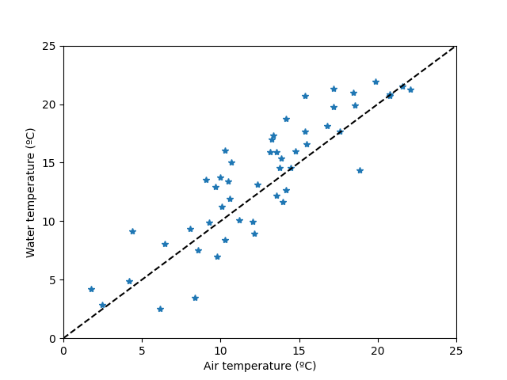

The objective of the exercise will be to estimate water temperature and its
uncertainty on the 1st and 15th of each month in 2015.

Prior uncertainty
^^^^^^^^^^^^^^^^^
Assume we did not have any available data on surface temperature in the
reservoir. And assume we need to estimate it. How confidently could we do it?
We can answer this question with Monte Carlo simulations.

Even in the absence of field data, we could still make an estimation based
on previous scientific knowledge. We know water temperature is highly correlated
to air temperature and that it can be estimated quite accurately using Eq.
:eq:`model_2`. Also, many studies have calibrated that model
in several instances, so that we can use expert judgement to provide an
estimation of the expected value and range of the parameters of the model.
The values on the following table are based on the results obtained by
Mohseni et al. (1998).

.. csv-table:: A first (expert-based) estimation of model parameters
    :header: **Parameter**, **Mean**, **Min.**, **Max.**

    :math:`\alpha` (ºC), 26.2, 10.8, 40.9
    :math:`\beta` (ºC), 13.3, 3.7, 20.8
    :math:`\gamma` (ºC\ :sup:`-1`\ ), 0.18, 0.10, 0.80
    :math:`\mu` (ºC), 0.8, 0.0, 8.9

From these parameters we can draw several random samples (e.g., 500 samples)
and carry simulations with each set of parameter values. In this case, since
we suppose we do not have any additional information. When there is no
information on the shape of the distribution of the parameter values, it
is often assumed that they follow a uniform distribution, which can be
considered a non-informative distribution.

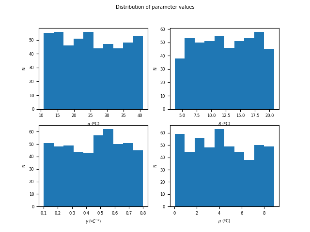

The simulated values for the different parameter sets provide the prior
uncertainty of the temperature estimations based on prior knowledge. We can
see that, as expected, uncertainty is quite large at this point.

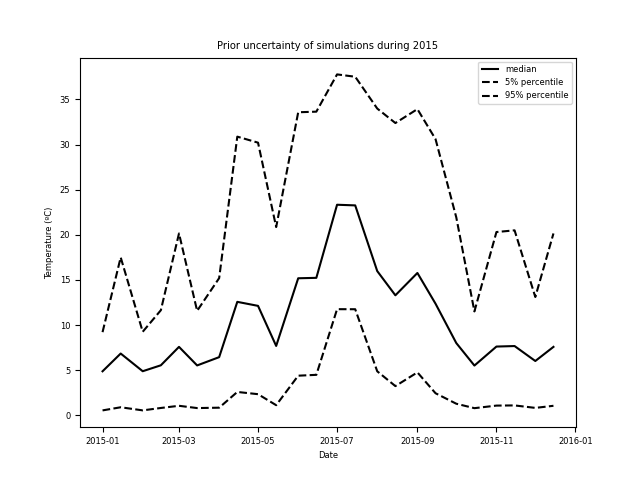

Sensitivity analysis
^^^^^^^^^^^^^^^^^^^^
To reduce simulation uncertainty, we need to calibrate the model choosing
appropriate values for the model parameters. However, before passing to calibration
it is helpful to make a sensitivity analysis to find which are the parameters
that have a greater influence in the simulation results. Given the large
uncertainty at this point, a global sensitivity analysis method should be used.
We will use here the method of Sobol.

The method of Sobol is a Monte Carlo-based method of decomposition of the
variance. The objective of the method is to assess the proportion of the output
variance that is due to each parameter. This method can reveal the existence of
nonlinearity and interactions between parameters. When using this method
usually two indexes are calculated: first-order sensitivity index
(:math:`S_i`) and total effect index (:math:`S_{T_i}`).

.. csv-table:: Sensitivity of model parameters (Sobol method, 400 samples)
    :header: **Parameter**, :math:`S_i`, :math:`S_{T_i}`

    :math:`\alpha`, 0.29, 0.52
    :math:`\beta`, 0.37, 0.55
    :math:`\gamma`, 0.03, 0.08
    :math:`\mu`, 0.01, 0.03

The first order sensitivity index :math:`S_i` measures the proportion of
the variance of the model output that is explained by each parameter (without
interactions). The index :math:`S_i` theoretically varies between 0
(unsensitive) and 1 (maximum sensitivity). The sum of all :math:`S_i` is
equal to 1 for additive models (the effect of the parameters is independent),
and it is less than 1 for nonadditive models (there are interactions between
the parameters). In this case, the sum of all :math:`S_i` is 0.7. Thus,
the variation in individual parameters explains 70% of the output variance
and the model may be considered to have a largely linear behaviour,
notwithstanding the rather large parameter space explored here.

.. note::

    When :math:`S_i` is calculated using the Sobol's method, it
    may take negative values because of numeric
    inaccuracies when :math:`S_i` is near zero and the sample size is small.

The total effect index :math:`S_{T_i}` measures the contribution to the
variance of the model output made by a parameter including interactions
with other parameters. The index :math:`S_{T_i}` is equal to :math:`S_i`
if there are no interactions between parameter :math:`X_i` and other
parameters, and greater than :math:`S_i` if there are interactions with
other parameters. If :math:`S_{T_i}=0`, the parameter :math:`X_i`
is noninfluential. The sum of all :math:`S_{T_i}` is usually greater than 1;
it is 1 only if the model is perfectly additive (no interactions between
parameters).

In our example, the parameters :math:`\alpha` and :math:`\beta` are the most
influential parameters: fixing the value of one of them would reduce the
output variance by more than 50%. The paramater :math:`\gamma` is much less
influential. And the parameter :math:`\mu` is
noninfluential since its total effect index is nearly zero.
Also, since the sum of :math:`S_i` is less than 1, the sum of
:math:`S_{T_i}` is greater than 1, and :math:`S_{T_i}>S_i` for the
parameters :math:`\alpha`, :math:`\beta` and :math:`\gamma`,
there are interactions between these parameters.

The following figure shows the 400 random realizations used to calculate
Sobol indexes superimposed on measurements. The figure shows visually that
there is a large uncertainty in the value of the parameters :math:`\alpha`
and :math:`\beta`, which determine, respectively, the upper asymptote and
the inflexion point of the logistic curve.

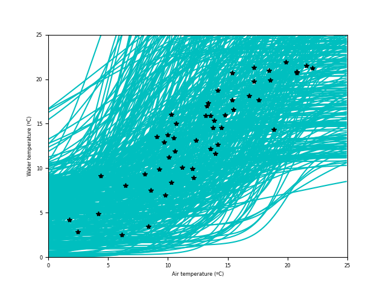

Calibration
^^^^^^^^^^^
In the previous section, we have seen that the parameters :math:`\gamma`
and :math:`\mu` are mostly noninfluential. This means that multiple
combinations of the values of these parameters results in simulations of
similar quality, thus increasing the uncertainty of parameter values. To
reduce this uncertainty, we may fix the value of
the parameters :math:`\gamma` and :math:`\mu` to their average values, and
calibrate the value of the parameters :math:`\alpha` and :math:`\beta`.

The previous process of fixing the value of some parameters is an example of
(manual) regularisation, a process by which the complexity of a model
is reduced so that the remaining parameters can be estimated uniquely (i.e., with
low uncertainty). Other more sophisticated regularisation methods include
Tikhonov regularisation and subspace regularisation.

Since there is a great uncertainty on the value of the parameters,
we will use Differential Evolution (DE) to make a first calibration.
DE is a global calibration method that explores the whole parameter space,
rather than a local range of parameter values. Thus this method provides
a global optimum.

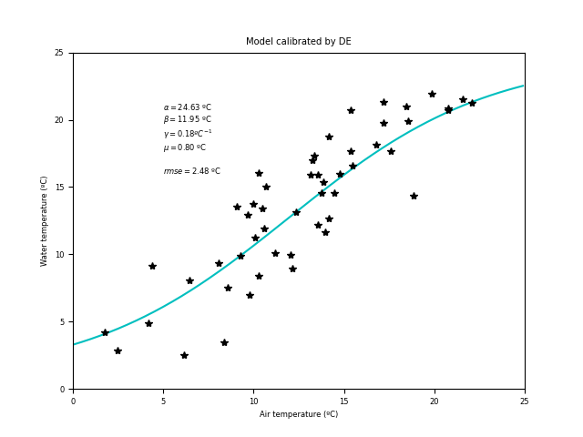

After applying a global calibration method it is advisable to refine the
calibration with a local method. Thus, we repeat the calibration with
the GLM algorithm, but now without fixing the parameters :math:`\gamma`
and :math:`\mu`. We can see there is just a slight improvement in RMSE.

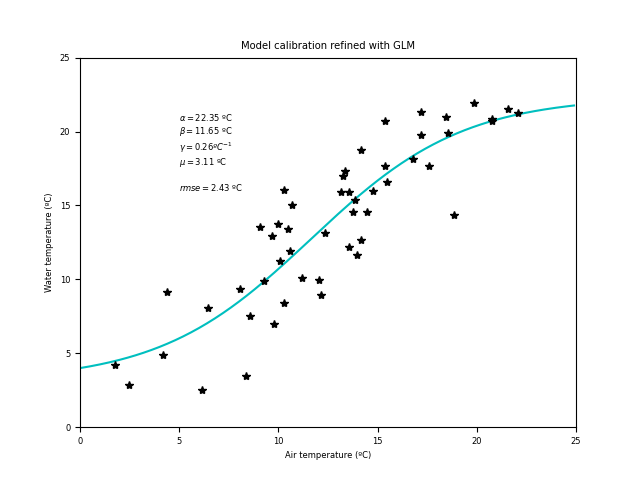

.. csv-table:: Calibrated values of model parameters
    :header: **Parameter**, **Mean**, **2.5% confidence value**, **97.5% confidence value**

    :math:`\alpha` (ºC), 22.3, 20.2, 24.4
    :math:`\beta` (ºC), 11.7, 10.6, 12.8
    :math:`\gamma` (ºC\ :sup:`-1`\ ), 0.26, 0.19, 0.34
    :math:`\mu` (ºC), 3.2, 0.6, 5.7

Posterior uncertainty (Schur's complement analysis)
^^^^^^^^^^^^^^^^^^^^^^^^^^^^^^^^^^^^^^^^^^^^^^^^^^^
Schur's complement analysis is valid when the model has linear (or almost linear)
response to variations in the value of the parameters. We already showed above
that the model has a nearly linear behaviour in the prior parameter space using
Sobol's uncertainty method of decomposition of variance. The following
table shows the reduction in parameter uncertainty through calibration
according to Schur's complement analysis.

.. csv-table:: Reduction of parameter uncertainty by calibration
    :header: **Parameter**, **Prior variance**, **Posterior variance**, **Reduction in par. uncertainty (%)**

    :math:`\alpha`, 56.6, 1.0, 98
    :math:`\beta`, 18.3, 0.4, 98
    :math:`\gamma`, 0.031, 0.002, 93
    :math:`\mu`, 4.95, 1.56, 69

After calibration the uncertainty of the parameters has been much reduced.
We note that the reduction in uncertainty for :math:`\mu` is less important
than for the other parameters. In fact, this parameter corresponds to the
lower asymptote of the logistic curve, but there are few low temperature
measurements to inform this parameter.

The reduction in the uncertainty of the parameter values results in a
decrease in the uncertainty of the simulations. Please note, though, that
in this case the uncertainty is the uncertainty due
to parametric uncertainty only and does not take into account measurement
error or model inadequacies.

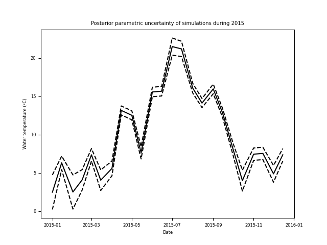

We note that uncertainty is not equal along the year.
Uncertainty is greater for periods of high and, especially, for low temperatures.

Data worth
^^^^^^^^^^
The following figure shows the percent reduction in uncertainty by parameter
and forecast date. It can be seen that forecasts on days with lower temperatures
are influenced mostly by :math:`\mu` and forecasts on days with the
highest temperatures are influenced mostly by :math:`\alpha`. This is quite logical
since :math:`\alpha` determines the higher asymptote of the logistic curve
and :math:`\mu` determines the lower asymptote.

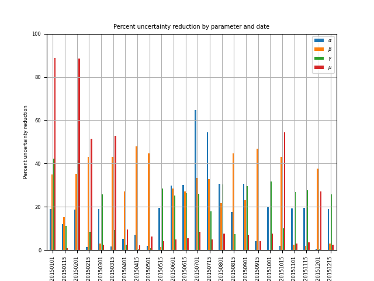

   This figure shows the percentage reduction in uncertainty that we would obtain in the
   estimation of the value of the parameters by acquiring a measurement on the given days.

If we wanted to reduce the uncertainty of winter and summer forecasts,
which measurements would we need to take? We can investigate this question
with the concept of data worth. In the next figure we show data worth as
the percent uncertainty increase when removing an observation for two
forecasts, for 1 January 2015 and for 1 July 2015. We see the most
valuable data to reduce forecast uncertainty is that which corresponds to the
same period of the year. We would thus need to concentrate our measurement
efforts in the summer and winter.

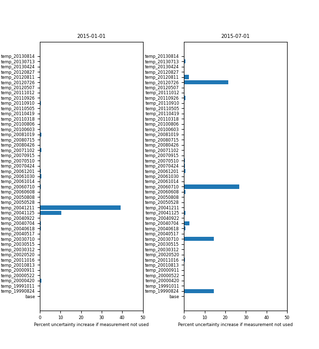

Posterior predictive error (error variance analysis)
^^^^^^^^^^^^^^^^^^^^^^^^^^^^^^^^^^^^^^^^^^^^^^^^^^^^
Error variance analysis is an alternative linear uncertainty analysis
method that decomposes the variance of predictive error into three
components:

* Potential forecast error arising from parameter uncertainty.
* Potential forecast error arising from model-to-measurement misfit
  (including measurement noise and structural noise).
* Potential forecast error arising from not calibrating all model parameters.

Thus, posterior predictive error is expected to be greater than posterior
uncertainty.

However, one of the difficulties in using error variance analysis lies in estimating
the number of singular values to use, which may introduce a certain degree of
subjectivity. The error variance analysis uses singular value
decomposition (SVD) to estimate the effective dimensionality of the system and
different criteria have been proposed to choose how many singular values
should be used:

* Identifying the place with a sharp elbow.
* Use as many singular values as necessary to account for at least 90 %
  (or 99%) of total energy.
* When residuals have mean zero and are uncorrelated (white noise),
  Gavish & Donoho (2014) proposed an optimal threshold of
  :math:`2.858y_{med}`, where :math:`y_{med}` is the median singular value.

The rational is that the few singular values kept are enough to characterise
most of the information, while the discarded singular values
represent mostly noise.

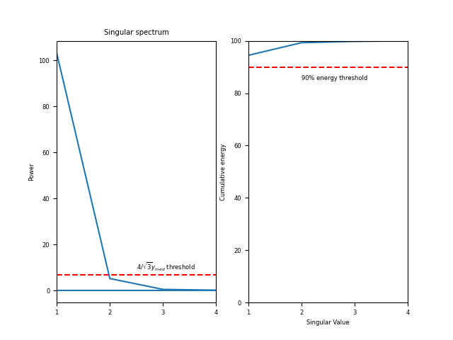

In our study case, we would need 2 singular values according to the 90%
energy criterion. But only 1, according to Gavish & Donoho's hard threshold.
However, this threshold might not be appropriate, since we expect the residuals
to be correlated. Besides, the power of the second singular value is quite near
to this threshold. Thus, we will use 2 singular values in this case.

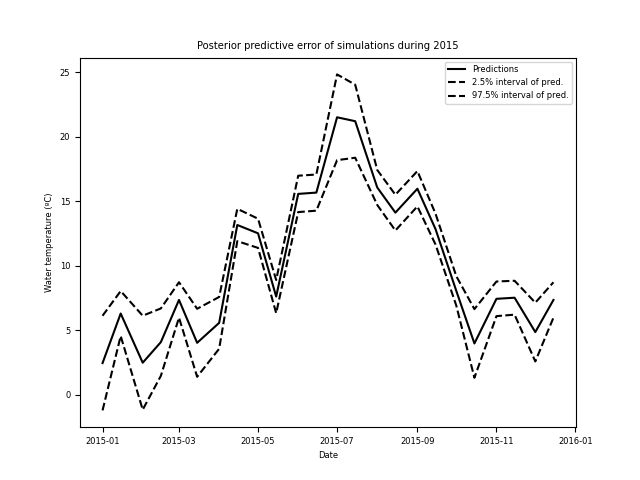

According to these results, predictive error is greater in the summer and in
the winter, in coherence with the results for posterior uncertainty.

Identifiability
^^^^^^^^^^^^^^^
Error variance analysis also provides an estimation of parameter identifiability.
According to parameter identifiability results (again, using 2 singular values),
the calibration data allow to determine uniquely the value of :math:`\gamma` (identifiability
near to one). However, for the other parameters the information is shared
between them, and the calibration data only allows to estimate a combination
of these parameters. This means that the solution obtained for the parameters
:math:`\alpha`, :math:`\beta` and :math:`\mu` is not unique, but one of
several possibilities with a similar error level. Also, parameters are
correlated among themselves.

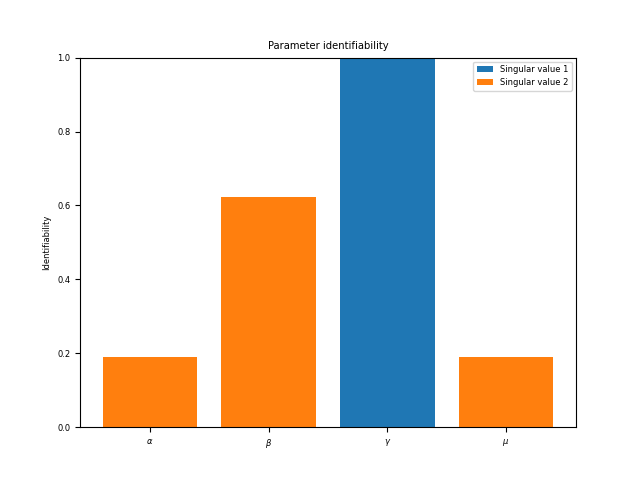

The parameters with highest identifiability in the study case are
:math:`\gamma` and :math:`\beta`, which determine the slope and location
of the curve around its inflexion point. But the available data does
not allow to determine as well the location of the S-curve asymptotes
indicated by :math:`\alpha` and :math:`\beta`.

Validation
^^^^^^^^^^
Validation may be considered as a test to assess the degree of coherence
of simulations with the observed behaviour. The following figure shows
temperature measurements taken in 2015, superimposed on simulations and
predictive uncertainty for all days in the same year.

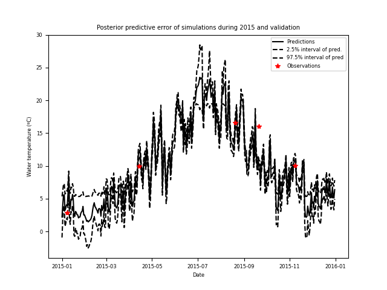

We see that the predictions are quite consistent with observations: most
measurements are within the estimated ranges of predictive error. However,
the fact that the measurement for 21 Sept. 2015 is outside the predictive
error range may indicate a model inadequacy.

In fact, the variability of estimated water temperature in spring and
autumn seems too large. Water temperature varies more slowly than air temperature,
and daily water temperature is best correlated to the average of air temperature
in the previous days. This is the rational for the modification proposed
by Koch & Grünewald (2010) to Eq. :eq:`model_2`.

Using the results in a management setting: effect of climate change
^^^^^^^^^^^^^^^^^^^^^^^^^^^^^^^^^^^^^^^^^^^^^^^^^^^^^^^^^^^^^^^^^^^
We can use the results obtained here to analyse a management question:
which would be the effect of climate change? To do this we will use the
same air temperatures for 2015 but increased by 1.5 ºC to simulate water temperature
using eq. :eq:`model_2`.

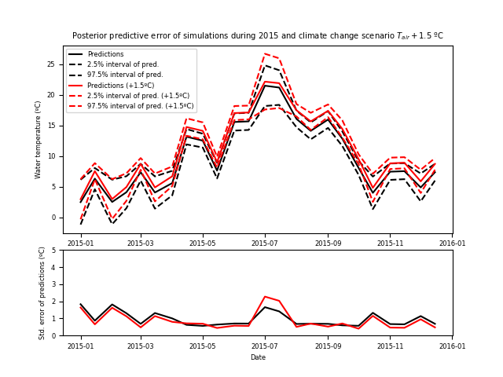

The model predicts an average increase of 1.1 ºC in water temperature
with a 1.5 ºC increase in water temperature. During most of the year
predictive uncertainty in the :math:`T_{air} + 1.5` ºC scenario is equal
or lower to that during the base scenario, with the exception of July
when it increases. It is also the month when uncertainty was already highest
for the base scenario. This is related to the difficulty in obtaining
a precise value for the parameter :math:`\alpha` and the fact that
the warming makes summer temperatures leave the range of values for which there is
information. This points to a critical issue: the difficulty in predicting
water temperature is greatest when there is a higher risk of high temperatures.

A note on the use of linear an nonlinear uncertainty methods
^^^^^^^^^^^^^^^^^^^^^^^^^^^^^^^^^^^^^^^^^^^^^^^^^^^^^^^^^^^^
Some of the previous analyses are based on the use of linear uncertainty
methods. The application of such methods to nonlinear models provides
approximate results only. However, although these methods do not allow
an exact estimation of uncertainty, they provide semi-quantitative
information sufficiently robust to analyse the relative contributions of
different sources of uncertainty or parameters (Moore & Doherty, 2005).

Nonlinear methods (such as Monte Carlo methods) could also be used to obtain
more appropriate quantitative results. However,
they require a much higher number of simulations, which may be prohibitive
if the model run time is large. Such methods allow analysing the effect of
parametric uncertainty as shown above (see `Prior uncertainty`_). Using such methods,
the effect of noise (measurement noise of model structural noise) can also
be taken into account by appropriately characterising it, for example, as
white noise (if noise is uncorrelated) or as a stochastic process. But
to determine the characteristics of noise may require a large dataset.

Thus, to choose between a linear or nonlinear method it is necessary to
take into account the model run time and computational cost of the method
and the available data.

References
----------

* Bennett, N.D.; Croke, B.F.W.; Guariso, G.; Guillaume, J.H.A.; Hamilton,
  S.H.; Jakeman, A.J.; Marsili-Libelli, S.; Newham, L.T.H.; Norton, J.P.;
  Perrin, C.; Pierce, S.A.; Robson, B.; Seppelt, R.; Voinov, A.A.; Fath, B.D.;
  Andreassian, V. (2013) Characterising performance of environmental models.
  *Environmental Modelling & Practice* 40, 1-20.
* Beck M.B. (1987) Water Quality Modeling: A Review of the Analysis of
  Uncertainty. *Water Resources Research* 23(8), 1393-1442.
* Beven, K.; Binley, A. (1992) The future of distributed models: model
  calibration and uncertainty prediction. *Hydrological Processes* 6, 279-298.
* Beven, K.; Freer, J. (2001) Equifinality, data assimilation, and uncertainty
  estimation in mechanistic modelling of complex environmental systems using
  the GLUE methodology. *Journal of Hydrology* 249, 11-29.
* Beven, K.; Young, P. (2013) A guide to good practice in modeling semantics
  for authors and referees. *Water Resources Research* 49, 5092-5098.
* Boschetti, F.; Grigg, N.J.; Enting, I. (2011) Modelling = conditional
  prediction. *Ecological Complexity* 8, 86-91.
* Doherty, J.; Hunt, R.J. (2009) Two statistics for evaluating parameter
  identifiability and error reduction. *Journal of Hydrology* 366, 119-127.
* Gavish, M.; Donoho, D.L. (2014) The optimal hard threshold for singular
  values is :math:`4/\sqrt{3}`. *IEEE Transactions on Information Theory*
  60(8), 5040-5053.
* Guillaume, J.H.A.; Jakeman, J.D.; Marsili-Libelli, S.; Asher, M.; Brunner,
  P.; Croke, B.; Hill, M.C.; Jakeman, A.J.; Keesman, K.J.; Razavi, S.; Stigter,
  J.D. (2019) Introductory overview of identifiability analysis: A guide to
  evaluating whether you have the right type of data for your modeling purpose.
  *Environmental Modelling & Software* 119, 418-432.
* Hall, J.W.; Boyce, S.A.; Wang, Y.; Dawson, R.J.; Tarantola, S.; Saltelli, A.
  (2009) Sensitivity analysis for hydraulic models. *Journal of Hydraulic
  Engineering* 135(11), 959-969.
* Jakeman, A.J.; Letcher, R.A.; Norton, J.P. (2006) Ten iterative steps
  in development and evaluation of environmental models. *Environmental
  Modelling & Software* 21, 602-614.
* Koch, H.; Grünewald, U. (2010) Regression models for daily stream
  temperature simulation: case studies for the river Elbe, Germany.
  *Hydrological Processes* 24, 3826-3836.
* Moore, C.; Doherty, J. (2005) Role of the calibration process in reducing model
  predictive error. *Water Resources Research* 41, W05020, 14 p.
* Oreskes, N.; Shrader-Frechette, K.; Belitz, K. (1994) Verification, validation,
  and confirmation of numerical models in the Earth sciences. *Science* 263,
  641-646.
* Prats, J.; Reynaud, N.; Rebière, D.; Peroux, T.; Tormos, T.; Danis,
  P.-A. (2018) LakeSST: Lake Skin Surface Temperature in French inland water
  bodies for 1999-2016 from Landsat archives. *Earth System Science Data* 10,
  727-743.
* Quintana-Seguí, P.; Le Migno, P.; Durand, Y.; Martin, E.; Habets, F.;
  Baillon, M.; Canellas, C.; Franchisteguy, L.; Morel, S. (2008) Analysis
  of near-surface atmospheric variables: validation of the SAFRAN analysis
  over France. *Journal of Applied Meteorology* 47, 92-107.
* Saltelli, A.; Tarantola, S.; Campolongo, F.; Ratto, M. (2004)
  *Sensitivity Analysis in Practice. A Guide to Assessing Scientific
  Models.* John Wiley & Sons, Ltd, Chichester. 219 p.
* Saltelli, A.; Ratto, M.; Andres, T.; Campolongo, F.; Cariboni, J.;
  Gatelli, D.; Saisana, M.; Tarantola, S. (2008) *Global Sensitivity analysis.
  The Primer.* John Wiley & Sons, Ltd, Chichester. 292 p.
* Saltelli, A.; Aleksankina, K.; Becker, W.; Fennell, P.; Ferretti, F.;
  Holst, N.; Li, S.; Wu, Q. (2019) Why so many published sensitivity
  analyses are false: A systematic review of sensitivity analysis
  practices. *Environmental Modelling & Software* 114, 29-39.
